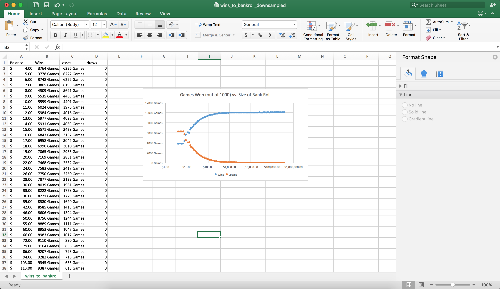

# research-labouchere
research-labouchere contains a work-in-progress simulation of the Labouchère system.

[Click Here to Read the Full Paper](pdf/An%20Investigation%20into%20Labouch%C3%A8re%E2%80%99s%20Betting%20System%20to%20Improve%20Odds%20of%20Favorable%20Outcomes%20to%20Generate%20a%20Positive%20Externality%20Empirically.pdf)

The Labouchere betting system is one of the strategies implemented in DiceBot (https://github.com/Seuntjie900/DiceBot), and open source tool that automatically runs betting strategies on online gambling websites.
This code helps simulate the eventual outcomes of running the Labouchere system.

See https://en.wikipedia.org/wiki/Labouch%C3%A8re_system

# Intellectual Property
Copyright (c) 2017 [Jake Billings]

The Paper An Investigation into Labouchère’s Betting System to Improve Odds of Favorable Outcomes to Generate a Positive Externality Empirically belongs to both Jake Billings and Sebastian Del Barco. This paper is excluded from the repository's MIT License, and all rights are reserved by the copyright holders (Jake Billings and Sebastian Del Barco).

See LICENSE for more information

