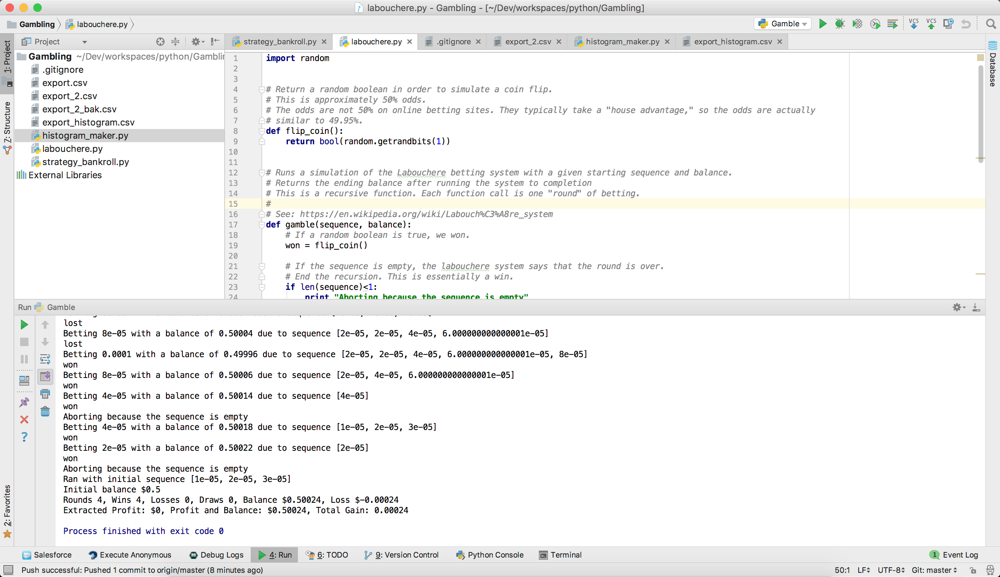

# research-labouchere
research-labouchere contains a work-in-progress simulation of the Labouchère system.

The Labouchere betting system is one of the strategies implemented in DiceBot (https://github.com/Seuntjie900/DiceBot), and open source tool that automatically runs betting strategies on online gambling websites.
This code helps simulate the eventual outcomes of running the Labouchere system.

See https://en.wikipedia.org/wiki/Labouch%C3%A8re_system
